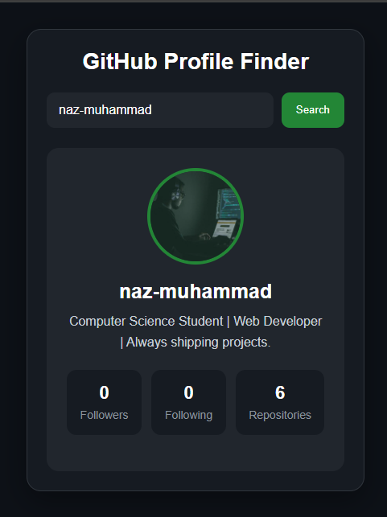
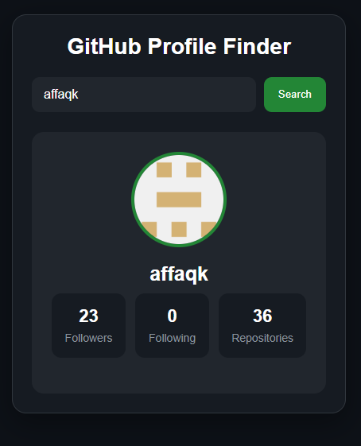

# 🔍 GitHub Profile Finder


A modern and responsive **GitHub Profile Finder** built using **HTML**, **CSS**, and **JavaScript**.

Search any GitHub username and instantly view profile information using the **GitHub REST API**.

---

## 🚀 Live Demo

🌐 https://github-profile-finder-by-naz.netlify.app

---

## 📸 Preview

### Desktop



### Mobile



### Search Result


---

## ✨ Features

- 🔍 Search GitHub users by username
- 👤 Display profile avatar
- 🏷️ Username
- 📝 User bio
- 👥 Followers count
- ➕ Following count
- 📦 Public repositories
- ❌ Invalid username handling
- 📱 Responsive UI
- ⚡ Fast and lightweight
- 🌐 Real-time data using GitHub REST API

---

## 🛠️ Tech Stack

- HTML5
- CSS3
- JavaScript (ES6+)
- Fetch API
- GitHub REST API

---

## 🧠 What I Learned

Building this project improved my understanding of:

- REST APIs
- Fetch API
- Asynchronous JavaScript
- Promises
- Response Object
- JSON Parsing
- Dynamic DOM Manipulation
- Template Literals
- Conditional Rendering
- Error Handling
- Responsive Design

---

## 🔗 GitHub API

Endpoint:

```text
https://api.github.com/users/{username}
```

Example:

```text
https://api.github.com/users/octocat
```

---

## 📂 Project Structure

```text
GitHub Profile Finder
│
├── assets
│   ├── github1.png
│   ├── github2.png
│   └── github3.png
│
├── index.html
├── style.css
├── index.js
└── README.md
```

---

## 💻 Getting Started

Clone the repository

```bash
git clone https://github.com/naz-muhammad/frontend-mini-projects-hub.git
```

Open the project folder.

Navigate to:

```text
10 - GitHub Profile Finder
```

Run:

```text
index.html
```

No installation or dependencies are required.

---

## 📬 Connect With Me

**GitHub**

https://github.com/naz-muhammad

**LinkedIn**

https://www.linkedin.com/in/naz-muhammad/

---

## ⭐ Support

If you like this project, consider giving the repository a **Star ⭐**.

It helps others discover my work and motivates me to continue building more projects.

---

**Made with ❤️ by Naz Muhammad**~